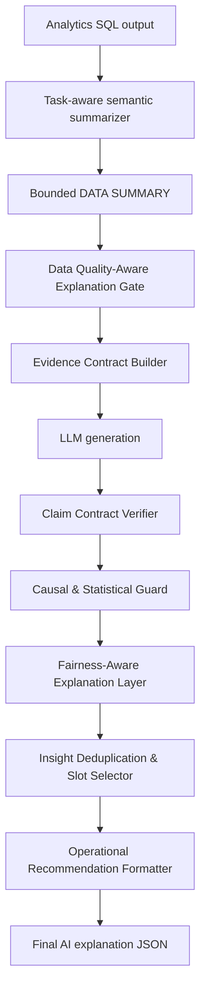

# Đặc tả kỹ thuật: Safe Evidence-Contracted AI Explanation

## 1. Mục tiêu
Thiết kế một phương pháp sinh AI explanation an toàn hơn cho education analytics, dựa trên các bug đã phát hiện trong evaluation.

Phương pháp cần cải thiện:
- độ bám evidence,
- correctness,
- data-quality awareness,
- causal/statistical safety,
- fairness/safety,
- actionability,
- novelty/diversity của insight,
- và đặc biệt là semantic prompt summarization để tránh lỗi `rows[:20]`.

Tên phương pháp:

**Safe Evidence-Contracted AI Explanation**

## 2. Nguyên tắc thiết kế
Không chỉ sửa prompt. Pipeline phải xem AI explanation là một quy trình có kiểm soát:

1. Tóm tắt dữ liệu theo ngữ nghĩa task.
2. Quyết định explanation mode theo data quality.
3. Xây evidence contract cho claim.
4. Gọi LLM sinh explanation.
5. Verify claim sau generation.
6. Chặn causal/statistical wording không đủ evidence.
7. Thêm fairness layer nếu task dùng dữ liệu nhạy cảm.
8. Chuẩn hóa recommendation thành action plan.

## 3. Kiến trúc tổng quan


## 4. Lớp Semantic Prompt Summarization
### 4.1 Vấn đề cần fix
Cách cũ dùng `rows[:20]` làm prompt data chính. Cách này prompt ngắn nhưng dễ sai ngữ nghĩa.

Case `A-G14`:
- SQL sort theo `final_outcome, week_number`.
- 20 dòng đầu thuộc `Distinction`.
- Task lại cần `Withdrawn`.
- AI dùng số đúng nhưng sai group, dẫn tới conclusion sai.

### 4.2 Nguyên tắc mới
Prompt không gửi raw rows tùy tiện. Prompt gửi **evidence-ready summary** theo từng loại task:

| Loại task | Dữ liệu nên gửi cho AI |
|---|---|
| Trend / time-series | first, last, peak, trough, largest drop/rise, target group, comparison group, reliability warning. |
| Risk / flag | triggered flags, severity counts, high-risk rows, thresholds, recommended actions nếu có. |
| Ranking | top K, bottom K, median, outliers, tie warnings. |
| Distribution | bin/group summary, group proportion, dominant segment, focus total. |
| Correlation | coefficient, sample size, strongest relationship, outliers, causal claim allowed hay không. |
| Comparison | group averages, count/denominator, gap, difference %, statistically weak/low-count groups. |

### 4.3 Summarizer đã có
| Summarizer | Task đã dùng | Mục tiêu |
|---|---|---|
| `trend_comparison` | `A-G14` | Target group theo thời gian và comparison groups. |
| `categorical_distribution` | `A-B02`, `A-B03`, `A-G10` | Category distribution, focus total, expected categories. |
| `risk_flags` | `S-T04`, `A-S04` | Triggered flags, severity, thresholds, action evidence. |
| `trend_series` | `S-T01`, `A-G18`, `A-G11` | Một chuỗi trend chính, first/last/peak/trough/largest change. |
| `generic_fallback` | Task chưa migrate | Row count, schema, first 5, last 5, numeric stats, categorical samples. |

### 4.4 Summarizer cần thiết kế tiếp
| Summarizer đề xuất | Dùng cho | Output chính |
|---|---|---|
| `ranking` | Ordered list/top-bottom tasks | top_items, bottom_items, median_item, metric_stats, outliers. |
| `group_comparison` | So sánh group | group_metrics, gaps, denominator, low_count_warnings. |
| `correlation_evidence` | Correlation/scatter tasks | coefficient, sample_size, p_value, outliers, causal_claim_allowed. |
| `numeric_distribution` | Histogram/bin numeric | bin summary, focus bins, dominant bin, tail counts. |

## 5. Explanation modes
Data Quality Gate chọn mode trước khi gọi LLM.

| Mode | Khi nào dùng | Output được phép |
|---|---|---|
| `normal` | Dataset executable, không rỗng, đủ required columns, evidence đủ. | Full summary, insights, implication, recommendations. |
| `limited` | Data partial, sparse, low reliability hoặc thiếu optional fields. | Insight có caveat, confidence bị cap. |
| `no_insight` | Thiếu required evidence cho claim goal. | Không sinh insight phân tích; nói rõ thiếu gì. |
| `data_diagnostic` | Dataset rỗng, unsupported dataset, capability missing, analytics failed. | Diagnostic report: thiếu data/capability nào, cần kiểm gì tiếp. |

Rule gợi ý:

```text
if analytics_failed or required_dataset_missing:
  mode = data_diagnostic
elif row_count == 0:
  mode = data_diagnostic
elif required_columns_missing:
  mode = no_insight
elif data_quality in ["insufficient", "partial"]:
  mode = limited
else:
  mode = normal
```

## 6. Registry-driven metadata
Task registry nên tiếp tục là nơi khai báo AI summary config và claim contract.

Ví dụ:

```json
{
  "aiSummaryType": "trend_series",
  "aiTimeColumn": "week_number",
  "aiMetricColumn": "week_total_clicks",
  "aiSecondaryMetricColumns": ["rolling_3wk_avg", "drop_pct"],
  "aiFlagColumns": ["is_drop_week"],
  "aiSortDirection": "asc",
  "aiMaxPoints": 40,
  "aiClaimTypes": ["trend", "drop_detection"],
  "aiRecommendationSchema": "operational_action"
}
```

Không migrate toàn bộ task một lượt. Mỗi batch chỉ nên chọn 2-3 task đại diện, có output schema rõ.

## 7. Evidence contract
Mỗi claim phải có contract:
- `claim_type`,
- `required_metrics`,
- `optional_metrics`,
- `allowed_wording`,
- `forbidden_wording`,
- `fallback_if_missing`.

| Claim type | Required evidence | Không được nói nếu thiếu evidence |
|---|---|---|
| `distribution` | category, count, percent | nguyên nhân vì sao distribution như vậy. |
| `trend` | time column, metric column, first/last, delta hoặc adjacent change | trend từ input chưa sort hoặc sample rows. |
| `comparison` | group column, group metric, denominator/count | group tốt/xấu hơn nếu thiếu denominator. |
| `correlation` | x, y, sample size, coefficient hoặc caveat rõ | strong/weak/significant/impact/causes. |
| `risk_flag` | flag name, flag value, threshold, triggered | invented risk label hoặc tự suy threshold direction. |
| `ranking` | entity, metric, top/bottom rule | top/bottom nếu input chưa sort và không tính lại. |
| `data_diagnostic` | data quality, missing fields/capability | normal insight/recommendation. |

## 8. Claim Contract Verifier
Verifier chạy sau LLM generation để kiểm từng insight.

Checklist:
- Insight có evidence không?
- Evidence có đủ required metrics không?
- Trend claim có dựa trên sorted time summary không?
- Comparison claim có denominator/gap không?
- Correlation claim có coefficient/sample size không?
- Risk claim có lấy từ configured flags không?
- Recommendation có trỏ về evidence thật không?
- Có dùng group/row bị omit để kết luận không?

Hành động khi fail:

| Lỗi | Xử lý |
|---|---|
| Thiếu required metric | Rewrite thành caveat hoặc bỏ claim. |
| Causal wording thiếu evidence | Rewrite thành association/descriptive wording. |
| Comparison thiếu denominator | Bỏ phrase so sánh mạnh. |
| Empty data nhưng sinh insight | Chuyển sang data diagnostic. |
| Duplicate insight | Merge hoặc bỏ insight giá trị thấp hơn. |
| Claim dựa trên low-count outlier | Thêm reliability caveat hoặc hạ severity. |

## 9. Causal & Statistical Guard
Không cho phép các cụm sau nếu thiếu causal/statistical evidence:
- causes,
- leads to,
- results in,
- due to,
- impact,
- effect,
- strong correlation,
- significant relationship.

Wording an toàn hơn:
- is associated with,
- appears alongside,
- is higher/lower in this dataset,
- may indicate,
- should be interpreted cautiously.

Rule:
```text
Chỉ được nói correlation strong/weak nếu DATA SUMMARY có coefficient.
Chỉ được nói significant nếu có p-value/confidence interval hoặc nguồn thống kê tương ứng.
Không được nói causal nếu task chỉ là correlation/distribution/comparison mô tả.
```

## 10. Fairness-Aware Layer
Áp dụng cho task dùng demographic, family, socioeconomic, lifestyle hoặc background.

Rules:
- Không gán nhãn risk cá nhân chỉ dựa trên sensitive/background attribute.
- Không dùng deterministic wording.
- Ưu tiên support-oriented recommendation.
- Thêm caveat rằng yếu tố nền chỉ là context, không phải causal proof.
- Tránh punitive recommendation.

Caveat mẫu:

```text
Các yếu tố nền tảng này chỉ nên được dùng như tín hiệu ngữ cảnh để lập kế hoạch hỗ trợ, không phải nhãn xác định rủi ro cho từng sinh viên.
```

## 11. Operational Recommendation Schema
Recommendation nên có format:

```json
{
  "priority": "high",
  "target": "students in the low engagement group",
  "evidence": "focus_total.percent = 25.0",
  "owner": "instructor or advisor",
  "first_action": "schedule a check-in and assign targeted practice",
  "timeframe": "within 1 week",
  "follow_up_metric": "engagement score and next assessment completion"
}
```

Nếu data insufficient:

```json
{
  "priority": "medium",
  "target": "data pipeline",
  "first_action": "verify engagement data availability for this cohort",
  "timeframe": "before interpreting engagement risk",
  "follow_up_metric": "non-empty engagement rows and required columns"
}
```

## 12. Insight diversification
Dùng slot để tránh insight trùng ý:
- data quality/caveat,
- primary distribution hoặc trend,
- comparison/subgroup,
- threshold/risk flag,
- operational implication.

Rule:
```text
Tối đa một insight cho mỗi slot, trừ khi task yêu cầu nhiều group.
Nếu hai insight dùng cùng metric và cùng ý, merge hoặc bỏ insight yếu hơn.
```

## 13. Kế hoạch triển khai
### Phase đã thực hiện
| Phase | Nội dung |
|---|---|
| Phase 1 | Framework summarizer, `generic_fallback`, `A-G14 trend_comparison`. |
| Phase 2 batch 1 | `categorical_distribution` cho `A-B02`, `A-B03`, `A-G10`. |
| Phase 2 batch 2 | `risk_flags` cho `S-T04`, `A-S04`. |
| Phase 2 batch 3 | `trend_series` cho `S-T01`, `A-G18`, `A-G11`. |

### Phase tiếp theo
| Priority | Module | Việc cần làm |
|---:|---|---|
| 1 | `ranking` | Top K, bottom K, median, outliers, tie warnings. |
| 2 | `group_comparison` | Group average, gap, denominator, low-count warnings. |
| 3 | `correlation_evidence` | Coefficient, sample size, p-value/outliers, causal guard. |
| 4 | Data Quality Gate | Mode normal/limited/no_insight/data_diagnostic. |
| 5 | Claim verifier | Validate structured AI output sau generation. |
| 6 | Recommendation formatter | Chuyển action chung thành operational action. |

## 14. Test strategy
### Unit tests
- Empty dataset trả về `data_diagnostic`.
- Missing required columns trả về `no_insight`.
- Partial data cap confidence và thêm caveat.
- Trend input unsorted vẫn sort đúng.
- Largest drop/rise tính sau sort.
- Target group không bị mất dù nằm cuối input.
- Risk flag không invent severity/action.
- Correlation thiếu coefficient không được nói strong/impact.
- Sensitive context có fairness caveat.
- Duplicate insight bị merge/drop.

### Integration tests
Chạy đại diện từng summarizer:
- `trend_comparison`: `A-G14`
- `categorical_distribution`: `A-B02`, `A-B03`, `A-G10`
- `risk_flags`: `S-T04`, `A-S04`
- `trend_series`: `S-T01`, `A-G18`, `A-G11`
- `generic_fallback`: task chưa migrate như `A-B04`

### Adversarial tests
Tạo input cố tình:
- target group nằm cuối,
- time bị đảo thứ tự,
- numeric values là string,
- low-count outlier cực lớn/cực nhỏ,
- missing optional columns,
- unknown boolean flag,
- correlation thiếu coefficient.

## 15. Success metrics
| Metric | Target |
|---|---|
| Major data-quality bugs | Giảm ít nhất 80%. |
| Semantic prompt truncation bugs | Không tái xuất hiện trên task đã migrate. |
| Evidence contract violations | Bằng 0 trên migrated tasks. |
| Unsupported causal/statistical claims | Bằng 0 trên guarded correlation tasks. |
| Generic recommendation rate | Giảm ít nhất 50%. |
| Duplicate insight rate | Giảm ít nhất 50%. |
| Prompt summary overflow | Không task nào vượt cap mà mất evidence chính. |

## 16. Rollback plan
- Tắt claim verifier/gate bằng feature flag nếu cần.
- Xóa metadata mới khỏi task registry của task bị lỗi.
- Giữ `generic_fallback` vì backward-compatible.
- Rollback từng summarizer branch, không rollback toàn bộ AI explanation pipeline.
- Không thay chart rendering hoặc frontend UI.

## 17. Kết luận kỹ thuật
Phương pháp mới nên được xem là:

```text
semantic summarization + data quality gate + evidence contract + post-generation verifier
```

Đây là hướng fix đúng cho các bug đã thấy: không chỉ giúp prompt ngắn hơn, mà còn giúp prompt đúng trọng tâm, claim có bằng chứng, recommendation có tính vận hành, và explanation an toàn hơn cho bối cảnh giáo dục.

