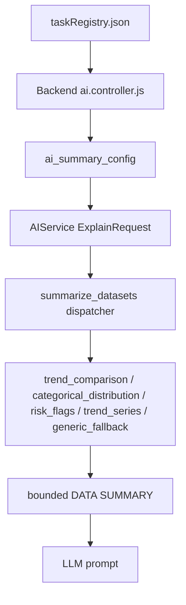

# Semantic Prompt Summarization Bug and Fix Plan

## 1. Tóm tắt vấn đề
AI Explanation từng gặp một bug quan trọng: dữ liệu gửi vào prompt bị rút gọn bằng cách lấy một lát cắt dòng đầu, tương đương `rows[:20]`.

Mục tiêu ban đầu của cách làm này là hợp lý: giới hạn độ dài prompt để tránh prompt quá lớn, tốn token, chậm và dễ vượt giới hạn model. Tuy nhiên, cách giới hạn bằng 20 dòng đầu là quá thô vì nó phụ thuộc hoàn toàn vào thứ tự SQL output. Nếu SQL sort không trùng với mục tiêu phân tích của task, AI sẽ nhìn đúng số liệu nhưng sai ngữ nghĩa.

Bug điển hình là `A-G14 - Early withdrawal signal analysis`.

Task này hỏi:

```text
Use early_warning_week [FE] to show when engagement collapsed for withdrawn students. Compare to passing students.
```

Tức là AI explanation phải tập trung vào:
- nhóm mục tiêu: `Withdrawn`,
- nhóm so sánh: `Pass`, có thể thêm `Distinction` làm benchmark,
- tín hiệu sớm: tuần nào engagement bắt đầu rơi mạnh,
- reliability: tuần nào có `student_count` quá nhỏ thì không nên kết luận mạnh.

Nhưng SQL output của `A-G14` được sort theo:

```sql
ORDER BY final_outcome, week_number
```

Theo thứ tự alphabet, `final_outcome` thường xuất hiện như:

```text
Distinction -> Fail -> Pass -> Withdrawn
```

Vì vậy 20 dòng đầu được gửi cho AI chủ yếu hoặc hoàn toàn thuộc nhóm `Distinction`. Chart/UI vẫn dùng full dataset nên vẽ đúng, nhưng AI explanation chỉ thấy phần đầu bị lệch trọng tâm. Kết quả là AI giải thích pattern của nhóm học tốt như thể đó là tín hiệu dropout.

## 2. Bản chất bug
Đây là bug về **semantic compression**, không phải bug render UI.

| Thành phần | Trạng thái |
|---|---|
| SQL chạy | Đúng |
| Chart rendering | Đúng vì nhận full dataset |
| AI prompt data | Sai trọng tâm vì bị truncate theo thứ tự dòng |
| AI text format | Render được |
| AI explanation meaning | Sai hoặc yếu vì evidence không khớp mục tiêu task |

Nói ngắn gọn:

```text
Prompt bị ngắn lại đúng cách về kích thước,
nhưng sai cách về ý nghĩa phân tích.
```

## 3. Triệu chứng trong A-G14
### 3.1 Summary
AI nói engagement giảm mạnh giữa week 2 và week 3. Nhưng dữ liệu không ủng hộ:
- Với `Distinction`: week 2 = `134.42`, week 3 = `157.00`, tức là tăng.
- Với `Withdrawn`: week 2 = `106.34`, week 3 = `127.82`, cũng là tăng.

Summary vì vậy sai turning point chính.

### 3.2 Insight dùng đúng số nhưng sai nhóm
AI dùng số `197.44 -> 134.42` từ week 1 sang week 2. Con số này đúng với nhóm `Distinction`, nhưng không phải tín hiệu dropout của nhóm `Withdrawn`.

Đây là dạng lỗi nguy hiểm:

```text
numeric value đúng,
nhưng evidence group sai,
nên conclusion sai.
```

### 3.3 Insight về đáy thấp nhất sai phạm vi
AI nói week 12 có `61.06` là điểm thấp nhất. Điều này chỉ đúng trong lát cắt đầu mà AI thấy, nhưng sai nếu xét toàn dataset vì nhóm `Withdrawn` có các điểm thấp hơn như week 29 hoặc các late weeks.

### 3.4 Recommendation bị lệch thời điểm
AI đề xuất can thiệp sau week 1/week 2, nhưng tín hiệu phù hợp hơn cho `Withdrawn` là sau đỉnh week 3, khi engagement rơi mạnh từ week 3 sang week 4.

## 4. Root cause kỹ thuật
Pipeline cũ có logic tương đương:

```python
def summarize_datasets(req, max_rows=20):
    for label, rows in req.datasets.items():
        truncated = rows[:max_rows]
```

Điểm yếu:
- Không biết task đang hỏi gì.
- Không biết group nào là target.
- Không biết time column nào cần sort.
- Không biết metric nào là chính.
- Không biết group nào cần so sánh.
- Không biết row cuối, peak, trough, largest drop/rise.
- Không biết sample size/reliability.

Với task có dữ liệu nhiều nhóm hoặc time-series, `rows[:20]` có thể làm mất nhóm quan trọng nhất.

## 5. Những task đã từng hoặc có nguy cơ bị lỗi kiểu này
### 5.1 Đã xác nhận trực tiếp
| Task | Tên | Bug / risk |
|---|---|---|
| `A-G14` | Early withdrawal signal analysis | Đã gặp bug rõ: AI nhìn nhóm `Distinction` trong 20 dòng đầu thay vì tập trung `Withdrawn`; conclusion sai mục tiêu dropout. |

### 5.2 Các task đã được migrate để giảm rủi ro prompt slice
| Task | Loại summarizer đã fix | Ý nghĩa fix |
|---|---|---|
| `A-G14` | `trend_comparison` | Tập trung `Withdrawn`, so sánh `Pass`/`Distinction`, tính first/last/peak/trough/largest drop/rise và reliability. |
| `A-B02` | `categorical_distribution` | Gửi distribution outcome đầy đủ, focus `Fail + Withdrawn`, không phụ thuộc first rows. |
| `A-B03` | `categorical_distribution` | Gửi phân bố effort theo thứ tự `very_low -> low -> medium -> high`, focus low tail. |
| `A-G10` | `categorical_distribution` | Gửi phân bố consistency theo thứ tự `high -> medium -> low`, focus low consistency evidence. |
| `S-T04` | `risk_flags` | Gửi triggered flags, severity, thresholds, recommended actions từ data thật. |
| `A-S04` | `risk_flags` | Gửi risk flag breakdown, không invent severity/action nếu SQL không trả về. |
| `S-T01` | `trend_series` | Gửi score trend theo `assessment_order`, first/last/peak/trough/largest drop/rise; không coi `pass_flag` là risk flag. |
| `A-G18` | `trend_series` | Gửi class performance trend theo `assessment_order`, giữ `pass_rate`, `completion_rate`, `submissions_count`. |
| `A-G11` | `trend_series` | Gửi weekly engagement drop theo `week_number`, flagged point chỉ từ `is_drop_week`. |

### 5.3 Các nhóm task có nguy cơ tương tự nếu chưa migrate
| Loại task | Vì sao có nguy cơ |
|---|---|
| Trend / time-series | Nếu SQL sort theo group hoặc category trước time, first rows có thể mất target series hoặc mất late drop. |
| Risk / flag | Nếu first rows chứa non-triggered hoặc low severity trước high severity, AI bỏ sót risk chính. |
| Ranking | Nếu SQL không sort đúng top/bottom theo metric cần phân tích, AI có thể chọn sai representative rows. |
| Distribution | Nếu nhiều bin/group, first rows có thể bỏ mất tail group hoặc dominant segment. |
| Correlation | Nếu chỉ gửi sample rows mà không gửi coefficient/sample size/outlier, AI dễ nói strength hoặc causality sai. |
| Comparison | Nếu first rows chỉ thuộc một group, AI thiếu denominator/gap để so sánh đúng. |

## 6. Hệ thống đã fix như thế nào
### 6.1 Nguyên tắc fix
Không tăng prompt length một cách thô. Thay vào đó chuyển từ:

```text
raw-row truncation
```

sang:

```text
task-aware semantic summarization
```

Tức là prompt vẫn ngắn, nhưng dữ liệu được nén theo ý nghĩa phân tích của task.

### 6.2 Thay đổi kiến trúc
Pipeline mới có `ai_summary_config` đi từ task registry sang AIService.

Luồng mới:



### 6.3 File đã thay đổi
| File | Vai trò |
|---|---|
| `Backend/src/config/taskRegistry.json` | Khai báo metadata summarizer theo từng task. |
| `Backend/src/controllers/ai.controller.js` | Forward `ai_summary_config` sang Python AIService. |
| `AIService/schemas.py` | Thêm `AISummaryConfig` vào `ExplainRequest`. |
| `AIService/strategies/base.py` | Thay `rows[:20]` bằng dispatcher và các summarizer theo task type. |
| `AIService/strategies/trend_strategy.py` | Prompt nhấn mạnh `DATA SUMMARY` là authoritative. |
| `AIService/debug_ai_summary.py` | Debug/self-test summary không cần gọi LLM. |

### 6.4 Các summarizer hiện có
#### `trend_comparison`
Dùng cho task cần phân tích một target group theo thời gian và so sánh với group khác.

Đã dùng cho:
- `A-G14`

Dữ liệu gửi AI:
- `target_group`,
- `comparison_groups`,
- `row_count`,
- `target_trend`,
- `comparison_trends`,
- `first_point`,
- `last_point`,
- `peak`,
- `trough`,
- `largest_adjacent_drop`,
- `largest_reliable_adjacent_drop`,
- `reliability_warnings`.

#### `categorical_distribution`
Dùng cho task phân bố category/bin/group.

Đã dùng cho:
- `A-B02`,
- `A-B03`,
- `A-G10`.

Dữ liệu gửi AI:
- distribution đầy đủ hoặc đã sắp thứ tự,
- `largest_category`,
- `focus_total`,
- missing expected/focus categories,
- metric evidence by category,
- percent total warning nếu lệch.

#### `risk_flags`
Dùng cho task flag/risk checklist.

Đã dùng cho:
- `S-T04`,
- `A-S04`.

Dữ liệu gửi AI:
- triggered/non-triggered counts,
- severity counts nếu có,
- triggered flags,
- threshold evidence,
- recommended actions nếu SQL trả về,
- unknown triggered warnings.

#### `trend_series`
Dùng cho time-series một chuỗi chính.

Đã dùng cho:
- `S-T01`,
- `A-G18`,
- `A-G11`.

Dữ liệu gửi AI:
- first/last/peak/trough,
- overall change,
- largest adjacent drop/rise,
- secondary metric evidence,
- flagged points chỉ từ configured flags,
- action evidence nếu có.

#### `generic_fallback`
Dùng cho task chưa migrate.

Dữ liệu gửi AI:
- row count,
- columns/schema,
- first 5 rows,
- last 5 rows,
- numeric stats,
- categorical group samples,
- warnings/truncation notes.

Mục tiêu của fallback là an toàn hơn `first 20 rows`, nhưng vẫn không thay thế được summarizer chuyên biệt.

## 7. Checklist kiểm tra lỗi tương tự
### 7.1 Kiểm tra nhanh bằng static review
Với mỗi task, kiểm:
- SQL `ORDER BY` có phục vụ đúng mục tiêu AI explanation không?
- Task có target group không?
- Task có comparison group không?
- Task có time column không?
- Task có metric chính không?
- Có reliability/sample size column không?
- `aiPromptHint` có nhắc một group/metric mà first rows có thể không chứa không?
- Chart có nhiều series/group nhưng AI prompt chỉ có một slice không?

### 7.2 Kiểm tra bằng debug summary
Chạy debug summary cho task:

```powershell
python AIService/debug_ai_summary.py --task A-G14
```

Điều cần nhìn:
- `summary_type` đúng chưa?
- `row_count` có full row count không?
- target group có xuất hiện không?
- largest drop/rise có tính sau sort không?
- warnings có cảnh báo sample thấp không?
- summary có bị truncate không?

### 7.3 Kiểm tra bằng synthetic adversarial data
Tạo dataset cố tình sort sai:
- group quan trọng nằm cuối,
- time bị đảo thứ tự,
- numeric values là string,
- row đầu chỉ chứa group không liên quan,
- có late outlier với sample size rất nhỏ.

Summarizer phải vẫn tìm đúng:
- target group,
- first/last theo time sort,
- peak/trough,
- largest reliable drop,
- triggered flags,
- top/bottom ranking,
- dominant distribution segment.

### 7.4 Kiểm tra output AI
Sau khi gọi AI:
- Summary có nói đúng target group không?
- Insight có dùng đúng group/metric không?
- Có lấy low-count outlier làm kết luận chính không?
- Recommendation có bám evidence summary không?
- Có claim nào dựa trên data bị omit không?

## 8. Phân loại task theo kiểu dữ liệu và plan fix
### 8.1 Trend / time-series
| Nội dung | Đặc tả |
|---|---|
| Dữ liệu nên gửi cho AI | first, last, peak, trough, overall change, largest drop/rise, target group, comparison group, reliability notes. |
| Summarizer hiện có | `trend_series`, `trend_comparison`. |
| Task đã migrate | `A-G14`, `S-T01`, `A-G18`, `A-G11`. |
| Rủi ro nếu chưa fix | AI chỉ thấy early rows hoặc wrong group; bỏ qua late collapse hoặc turning point chính. |
| Plan fix | Thêm registry metadata: `aiSummaryType`, `aiTimeColumn`, `aiMetricColumn`, optional `aiGroupColumn`, `aiTargetGroup`, `aiComparisonGroups`, `aiReliabilityColumn`, `aiFlagColumns`. |
| Test bắt buộc | Unsorted input vẫn sort đúng; largest drop/rise sau sort; target group không bị mất; low sample warnings. |

Ví dụ metadata:

```json
{
  "aiSummaryType": "trend_series",
  "aiTimeColumn": "week_number",
  "aiMetricColumn": "week_total_clicks",
  "aiSecondaryMetricColumns": ["rolling_3wk_avg", "drop_pct"],
  "aiFlagColumns": ["is_drop_week"],
  "aiSortDirection": "asc",
  "aiMaxPoints": 40
}
```

### 8.2 Risk / flag task
| Nội dung | Đặc tả |
|---|---|
| Dữ liệu nên gửi cho AI | triggered flags, severity counts, threshold evidence, high-risk rows, recommendation/action evidence. |
| Summarizer hiện có | `risk_flags`. |
| Task đã migrate | `S-T04`, `A-S04`. |
| Rủi ro nếu chưa fix | AI bỏ sót high severity flag hoặc invent reason/action không có trong SQL. |
| Plan fix | Thêm metadata flag columns: `aiFlagNameColumn`, `aiFlagValueColumn`, `aiThresholdColumn`, `aiTriggeredColumn`, optional severity/action/support fields. |
| Test bắt buộc | Parse triggered true/false ổn định; unknown triggered không đoán; triggered sort trước; severity order đúng; missing optional warning không crash. |

Ví dụ metadata:

```json
{
  "aiSummaryType": "risk_flags",
  "aiFlagNameColumn": "flag_name",
  "aiFlagValueColumn": "flag_value",
  "aiThresholdColumn": "threshold",
  "aiTriggeredColumn": "triggered",
  "aiSeverityOrder": ["high", "medium", "low", "info"],
  "aiMaxFlags": 10
}
```

### 8.3 Ranking task
| Nội dung | Đặc tả |
|---|---|
| Dữ liệu nên gửi cho AI | top K, bottom K, median, rank metric stats, outliers, ties, total row count. |
| Summarizer cần thiết | `ranking` hoặc `ranked_distribution`. |
| Rủi ro nếu chưa fix | AI nhìn first rows nhưng không chắc đó là top/bottom thật; bỏ qua tail hoặc outlier. |
| Plan fix | Thiết kế summarizer mới đọc `rank_column`, `entity_column`, `metric_column`, `sort_direction`, `top_k`, `bottom_k`, optional group/segment. |
| Test bắt buộc | Input unsorted vẫn chọn đúng top/bottom; tie handling; median đúng; cap output; không invent rank nếu thiếu metric. |

Đề xuất metadata:

```json
{
  "aiSummaryType": "ranking",
  "aiEntityColumn": "student_id",
  "aiMetricColumn": "avg_score",
  "aiRankColumn": "rank",
  "aiSortDirection": "desc",
  "aiTopK": 5,
  "aiBottomK": 5,
  "aiOutlierMethod": "iqr"
}
```

Expected DATA SUMMARY:

```json
{
  "summary_type": "ranking",
  "row_count": 120,
  "metric_column": "avg_score",
  "top_items": [],
  "bottom_items": [],
  "median_item": {},
  "metric_stats": {},
  "outliers": [],
  "summarization_warnings": []
}
```

### 8.4 Distribution task
| Nội dung | Đặc tả |
|---|---|
| Dữ liệu nên gửi cho AI | bin summary, group proportion, dominant segment, focus group/tail, missing expected categories. |
| Summarizer hiện có | `categorical_distribution`; có thể mở rộng thêm `numeric_distribution`. |
| Task đã migrate | `A-B02`, `A-B03`, `A-G10`. |
| Rủi ro nếu chưa fix | AI bỏ qua bin nhỏ nhưng quan trọng hoặc mô tả sai dominant segment. |
| Plan fix | Với categorical: tiếp tục dùng `categorical_distribution`. Với numeric bins: thêm metadata bin/range hoặc summarizer `numeric_distribution`. |
| Test bắt buộc | Category order preserved; missing expected categories reported; percent total tolerance; focus_total đúng; không tự gán risk label. |

Đề xuất mở rộng numeric distribution:

```json
{
  "aiSummaryType": "numeric_distribution",
  "aiBinColumn": "score_bucket",
  "aiCountColumn": "student_count",
  "aiPercentColumn": "pct_of_class",
  "aiMetricColumns": ["avg_score_in_bucket"],
  "aiFocusBins": ["0-10", "10-20"]
}
```

### 8.5 Correlation task
| Nội dung | Đặc tả |
|---|---|
| Dữ liệu nên gửi cho AI | coefficient, sample size, x/y columns, p-value nếu có, strongest relationship, outliers, missingness. |
| Summarizer cần thiết | `correlation_evidence`. |
| Rủi ro nếu chưa fix | AI nói strong/weak correlation hoặc causal impact khi chỉ có scatter/sample rows. |
| Plan fix | SQL hoặc backend summary phải cung cấp coefficient/sample size. Nếu không có coefficient, summary phải chặn strength claim và chỉ cho phép descriptive association. |
| Test bắt buộc | Không nói `strong`, `significant`, `impact`, `causes` nếu thiếu coefficient/p-value; sample size thấp cảnh báo; outlier không thành causal conclusion. |

Đề xuất metadata:

```json
{
  "aiSummaryType": "correlation_evidence",
  "aiXColumn": "engagement_score",
  "aiYColumn": "avg_score",
  "aiCoefficientColumn": "correlation",
  "aiSampleSizeColumn": "sample_size",
  "aiPValueColumn": "p_value",
  "aiOutlierColumns": ["student_id"]
}
```

Expected DATA SUMMARY:

```json
{
  "summary_type": "correlation_evidence",
  "x_column": "engagement_score",
  "y_column": "avg_score",
  "sample_size": 200,
  "coefficient": 0.42,
  "p_value": null,
  "strength_claim_allowed": true,
  "causal_claim_allowed": false,
  "outliers": [],
  "summarization_warnings": []
}
```

### 8.6 Comparison task
| Nội dung | Đặc tả |
|---|---|
| Dữ liệu nên gửi cho AI | group averages, group counts/denominators, gap, difference %, weak groups, missing groups. |
| Summarizer cần thiết | `group_comparison`. |
| Rủi ro nếu chưa fix | AI so sánh nhầm group, thiếu denominator, hoặc phóng đại gap trên sample nhỏ. |
| Plan fix | Thêm metadata group/metric/count/percent columns, target/comparison groups, minimum reliable count. |
| Test bắt buộc | Missing group warning; denominator present; gap computed đúng; low-count group warning; no causal wording. |

Đề xuất metadata:

```json
{
  "aiSummaryType": "group_comparison",
  "aiGroupColumn": "final_outcome",
  "aiMetricColumn": "avg_score",
  "aiCountColumn": "student_count",
  "aiTargetGroup": "Withdrawn",
  "aiComparisonGroups": ["Pass", "Distinction"],
  "aiMinimumReliableCount": 10
}
```

Expected DATA SUMMARY:

```json
{
  "summary_type": "group_comparison",
  "row_count": 4,
  "target_group": "Withdrawn",
  "comparison_groups": ["Pass", "Distinction"],
  "group_metrics": [],
  "gaps": [],
  "low_count_warnings": [],
  "summarization_warnings": []
}
```

## 9. Recommended migration roadmap
Không nên sửa tất cả task cùng lúc. Mỗi loại task có logic evidence khác nhau.

### Phase đã hoàn thành
| Phase | Nội dung |
|---|---|
| Phase 1 | Framework summarizer, `generic_fallback`, `A-G14 trend_comparison`. |
| Phase 2 batch 1 | `categorical_distribution` cho `A-B02`, `A-B03`, `A-G10`. |
| Phase 2 batch 2 | `risk_flags` cho `S-T04`, `A-S04`. |
| Phase 2 batch 3 | `trend_series` cho `S-T01`, `A-G18`, `A-G11`. |

### Phase tiếp theo đề xuất
| Priority | Loại task | Việc cần làm |
|---:|---|---|
| 1 | Ranking | Thiết kế `ranking` summarizer vì top/bottom thường cần evidence rõ và dễ test. |
| 2 | Comparison | Thiết kế `group_comparison` cho group gap/denominator/reliability. |
| 3 | Correlation | Thiết kế `correlation_evidence`; cần cẩn thận vì có causal/statistical overclaim. |
| 4 | Numeric distribution | Mở rộng distribution cho histogram/bin numeric nếu categorical chưa đủ. |

## 10. Acceptance criteria chung
Một task được coi là đã fix prompt summarization nếu:
- Không còn phụ thuộc vào `rows[:20]` làm nguồn evidence chính.
- Summary có `summary_type` đúng.
- Summary có `row_count`.
- Summary chứa đúng target group hoặc focus category nếu task yêu cầu.
- Summary tính các metric chính sau khi sort/group đúng.
- Summary có cảnh báo nếu thiếu column, thiếu group, low sample size, hoặc bị cap.
- Prompt summary không vượt guardrail kích thước.
- AI explanation không dùng group/row bị omit để kết luận chính.
- Task chưa migrate vẫn dùng `generic_fallback` và không crash.

## 11. Kết luận
Bug A-G14 cho thấy giới hạn prompt bằng first rows là không đủ an toàn cho education analytics. Dữ liệu gửi cho AI phải được nén theo ý nghĩa phân tích của task, không theo thứ tự vật lý của SQL output.

Hệ thống đã bắt đầu fix bằng registry-driven summarizers:
- `trend_comparison`,
- `categorical_distribution`,
- `risk_flags`,
- `trend_series`,
- `generic_fallback`.

Các bước tiếp theo là tiếp tục migrate theo loại task dữ liệu: ranking, comparison, correlation và numeric distribution. Mỗi summarizer cần có self-test, debug output và acceptance criteria riêng để tránh tái xuất hiện bug "đúng số nhưng sai ngữ nghĩa".

