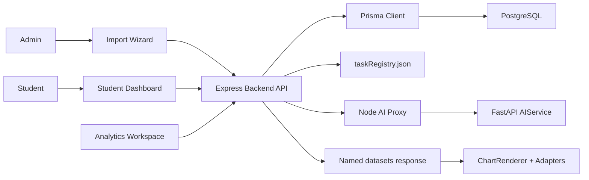
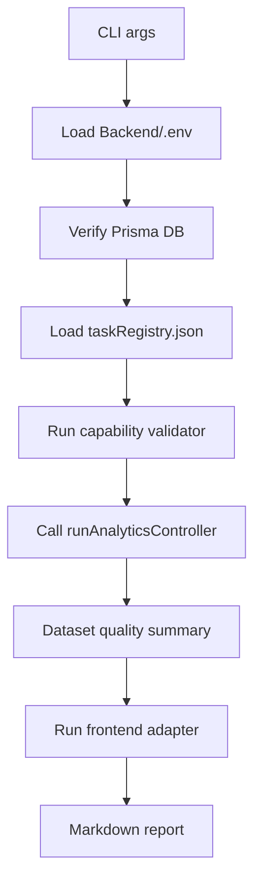

# Báo cáo kiến trúc hệ thống

> Phạm vi: tài liệu này được viết lại bằng tiếng Việt dựa trên source code hiện tại trong repository. Các nhận định về hiện trạng chỉ dựa trên code đã đọc; phần đề xuất tương lai được tách riêng để không nhầm với tính năng đã hoàn thiện.

## 1. Tổng quan hệ thống

Hệ thống là một prototype learning analytics gồm ba lớp runtime chính:

1. **Frontend web application**
   - Vị trí: `Frontend/`
   - Công nghệ: React 19, Vite, React Router, TanStack Query, Recharts, Ant Design.
   - Chức năng chính: chọn vai trò, import dataset, chọn active dataset, duyệt/chạy analytics task, render biểu đồ bằng `ChartRenderer`, hiển thị AI insight.

2. **Backend API Node.js**
   - Vị trí: `Backend/`
   - Công nghệ: Express 5, Prisma 7, PostgreSQL, multer, csv-parser.
   - Chức năng chính: upload/profiling CSV, gợi ý và xác nhận mapping, transform dữ liệu sang schema chuẩn hóa, quản lý dataset, task registry, capability validation, thực thi SQL analytics, proxy AI explanation.

3. **AI explanation service Python**
   - Vị trí: `AIService/`
   - Công nghệ: FastAPI, Pydantic.
   - Chức năng chính: nhận payload đã enrich từ Node, chọn explanation strategy, validate response, safety filter, trả degraded response khi AI không khả dụng.

Ngoài runtime chính còn có **one-click debug agent** trong `agents/`. Agent này dùng để validate/report, không phải thành phần user flow bình thường và không tự sửa source code.



## 2. Vai trò người dùng: admin và student

Điểm chọn vai trò nằm ở `Frontend/src/pages/RoleSelectionPage.jsx`.

### Admin

Admin tập trung vào dataset và phân tích cohort:

- Lần đầu sử dụng được điều hướng đến `/data-selection`.
- Có thể import dataset qua flow `/import/upload`, `/import/review`, `/import/confirm`, `/import/complete`.
- Có thể xem admin dashboard tại `/admin/dashboard`.
- Có thể dùng analytics workspace tại `/analytics`.
- Các task hướng admin trong `taskRegistry.json` thường có scope `Cohort`, `Many students`, hoặc `2 students`, với `target_audience` như `admin`, `instructor`, `academic_advisor`.

### Student

Student tập trung vào insight cá nhân:

- Student được điều hướng đến `/student/dashboard`.
- Dashboard load active dataset, class list, student list và các student task tương thích.
- Một số task cơ bản được auto-run khi có đủ `dataset/class/student`.
- Kết quả render bằng cùng `ChartRenderer` dùng trong analytics workspace.

### State dùng chung

`Frontend/src/contexts/AppContext.jsx` quản lý:

- `activeDataset`
- `importHistory`
- `isFirstUse`
- `isLoading`

Backend source of truth cho active dataset nằm ở `app_state` và `import_batch`.

## 3. Luồng end-to-end

Luồng chính của hệ thống:

`dataset import -> schema normalization -> task availability -> analytics execution -> API response -> chart rendering`

### 3.1 Dataset import

Frontend:

- `Frontend/src/pages/ImportPage.jsx`
- `Frontend/src/pages/import-steps/UploadStep.jsx`
- `Frontend/src/services/importApi.js`

Backend:

- `Backend/src/routes/import.routes.js`
- `Backend/src/controllers/import.controller.js`
- Endpoints:
  - `POST /api/import/profile`
  - `POST /api/import/confirm-mapping`
  - `POST /api/import/preview`
  - `POST /api/import/run`

`profileImportController` thực hiện các bước:

1. Nhận CSV bằng `multer`.
2. Detect delimiter bằng `detectCsvDelimiter`.
3. Parse raw rows bằng `parseCsvFileToRawRows`.
4. Profile CSV bằng `profileCSV`.
5. Detect dataset type và file role bằng `detectDatasetType`, `inferFileRole`.
6. Gợi ý mapping bằng `suggestMappingsFromProfiling`.
7. Detect bundle schema bằng `detectBundleSchema`.
8. Lưu session bằng `createUploadSession`.
9. Xóa file upload tạm.

### 3.2 Schema normalization

Mapping được xác nhận bởi `Backend/src/services/mappingConfirm.service.js`:

- Set `mapping_status = "confirmed"`.
- Validate strict bằng `validateMapping`.
- Ghi learned alias khi user manual map một field trước đó chưa rõ.

Import pipeline nằm ở `Backend/src/services/runImportPipeline.service.js`:

1. **Transform**
   - Gọi `transformRawRowsToCanonical`.
   - Validate mapping strict.
   - Chuyển raw rows thành 8 nhóm entity chuẩn hóa.
   - Derive surrogate/context IDs.
   - Unpivot nhiều score columns thành nhiều assessment rows.

2. **Feature engineering**
   - Gọi `computeStudentFeatures`.
   - Tính các field như `lifestyle_risk_score`, `support_score`, `social_balance_score`, `family_stability_score`, `disadvantage_score`.
   - Một số row-level FE được tính trong transform: `registration_lead_time`, `pass_flag`, `log_click_score`, `week_of_class`.

3. **Insert DB**
   - Gọi `insertNormalizedEntities`.
   - Deduplicate từng entity array.
   - Insert theo thứ tự FK-safe: course, class, student, enrollment, assessment, assessment_result, event, engagement.
   - Dùng `createMany(..., skipDuplicates: true)`.

Sau import thành công, backend ghi `ImportBatch` và activate dataset bằng `activateDatasetByBatchId`.

### 3.3 Task availability

Task metadata nằm ở `Backend/src/config/taskRegistry.json`.

Runtime service:

- `Backend/src/services/taskRegistry.service.js`

Validation endpoints:

- `GET /api/tasks/validate/:datasetId`
- `GET /api/tasks/validate-one/:taskId`

Validator chính:

- `Backend/src/services/capabilityValidator.service.js`
- `Backend/src/services/canonicalCapability.service.js`

Validator chạy 4 lớp A/B/C/D trước khi analytics task được coi là sẵn sàng.

### 3.4 Analytics execution

Endpoint:

- `POST /api/analytics/run`
- Controller: `Backend/src/controllers/analytics.controller.js`

Controller thực hiện:

1. Tạo `executionId`.
2. Kiểm tra `taskId`.
3. Resolve `enrollment_id` nếu request có `student_id + class_id + batch_id`.
4. Bắt buộc có `params.batch_id` để validate capability.
5. Load task từ registry.
6. Resolve batch context từ `import_batch`.
7. Chạy capability validator.
8. Hard-block nếu status là `unsupported`.
9. Chạy SQL bằng `executeSqlTask`.
10. Normalize result thành `datasets` theo `query_labels`.
11. Validate output schema bằng `validateOutputSchema`.
12. Trả response cho frontend.

### 3.5 API response

Response analytics chuẩn có dạng:

```json
{
  "success": true,
  "executionId": "exec_...",
  "taskId": "S-B01",
  "datasets": {
    "performance_summary": []
  },
  "meta": {
    "taskId": "S-B01",
    "isMultiQuery": false,
    "rowCount": 1,
    "executionTimeMs": 42,
    "queryHash": "abcd1234",
    "query_labels": ["performance_summary"],
    "dataQuality": {
      "status": "executable",
      "confidence": "HIGH",
      "confidence_reason": "...",
      "warnings": []
    }
  }
}
```

Với multi-query task, `datasets` có nhiều key theo `query_labels`.

### 3.6 Chart rendering

Frontend path:

- `Frontend/src/services/analyticsApi.js`
- `Frontend/src/hooks/useAnalytics.js`
- `Frontend/src/pages/AnalyticsWorkspace.jsx`
- `Frontend/src/components/ChartRenderer.jsx`

`ChartRenderer`:

1. Đọc `taskMeta.viz_type`.
2. Đọc `visualization_config`.
3. Derive required chart fields.
4. Chọn dataset block phù hợp.
5. Chọn adapter từ `ADAPTER_MAP`.
6. Transform raw rows thành chart data.
7. Render chart component từ `CHART_MAP`.
8. Hiển thị diagnostics: dataset block, valid rows, skipped rows, missing fields, null policy, warnings.

## 4. Kiến trúc backend

`Backend/src/server.js` cấu hình:

- CORS cho local frontend ports.
- Body limit 50MB.
- Routes:
  - `/api/import`
  - `/api/datasets`
  - `/api/tasks`
  - `/api/analytics`
  - `/api/ai`
  - `/api/students`
  - `/api/classes`
- Health check: `/api/health`.
- Startup seed sample datasets bằng `seedSampleDatasets`.
- Cleanup upload sessions bằng `clearExpiredUploadSessions`.

Backend được chia theo các lớp:

- `routes/`: khai báo HTTP routes.
- `controllers/`: validate request, gọi service, shape response.
- `services/`: domain logic chính.
- `config/`: canonical fields, dataset rules, registry, feature rules.
- `repositories/`: persistence helpers như alias memory.
- `lib/`: Prisma client, SQL/capability utilities.
- `utils/`: tiện ích text, math, dataset.

Services quan trọng:

- `profiling.service.js`
- `schemaDetect.service.js`
- `mappingSuggest.service.js`
- `mappingValidation.service.js`
- `mappingConfirm.service.js`
- `mappingTransform.service.js`
- `compositeFeatures.service.js`
- `entityInsert.service.js`
- `taskRegistry.service.js`
- `capabilityValidator.service.js`
- `canonicalCapability.service.js`
- `sqlExecution.service.js`
- `outputSchema.service.js`
- `activeDataset.service.js`
- `historyManager.service.js`

## 5. Kiến trúc frontend

`Frontend/src/App.jsx` định nghĩa route lazy-load:

- `/`
- `/choose-role`
- `/data-selection`
- `/analytics`
- `/student/dashboard`
- `/admin/dashboard`
- `/import/upload`
- `/import/review`
- `/import/confirm`
- `/import/complete`

`Frontend/src/main.jsx` wrap app bằng:

- `QueryClientProvider`
- `AppProvider`

TanStack Query được cấu hình:

- `staleTime`: 5 phút ở global config.
- `retry`: 1.
- `refetchOnWindowFocus`: false.

Import UI gồm 4 bước:

1. Upload CSV và khai báo source schema.
2. Review mapping suggestions.
3. Confirm và run pipeline.
4. Complete, hiển thị kết quả và sync active dataset.

Analytics UI gồm:

- `TaskListPanel`: duyệt/search/filter tasks.
- `TaskDetailPanel`: hiển thị metadata và params.
- `useAnalytics`: chạy analytics mutation.
- `ChartRenderer`: render chart.
- `ResultDisplay`: raw table/JSON fallback.
- `AIInsightPanel`: gọi AI explanation.

## 6. Kiến trúc database/schema

Prisma schema nằm ở `Backend/prisma/schema.prisma`, dùng PostgreSQL.

### Core entities

- `Student`
- `Course`
- `Class`
- `Enrollment`
- `Assessment`
- `AssessmentResult`
- `Event`
- `Engagement`

### Operational entities

- `AppState`
- `ImportBatch`
- `AliasMemory`
- `UploadSession`
- `AiExplanationLog`

### Đặc điểm schema

- Mọi learning entity đều có `batch_id` và `source_dataset`.
- `ImportBatch` quản lý dataset history, active flag, sample flag, row count, status.
- Quan hệ FK có cascade delete từ `ImportBatch` ở nhiều bảng.
- Các unique/index constraints giúp tránh duplicate theo batch và tăng hiệu năng truy vấn.
- Một số FE fields được lưu trực tiếp trong bảng:
  - Student: `lifestyle_risk_score`, `support_score`, `social_balance_score`, `family_stability_score`, `disadvantage_score`.
  - Enrollment: `registration_lead_time`.
  - Assessment: `week_of_class`.
  - AssessmentResult: `pass_flag`.
  - Engagement: `log_click_score`.
- Cross-table metrics như risk score, class averages, trends được tính ở SQL analytics runtime.

```mermaid
erDiagram
  IMPORT_BATCH ||--o{ STUDENT : contains
  IMPORT_BATCH ||--o{ COURSE : contains
  IMPORT_BATCH ||--o{ CLASS : contains
  IMPORT_BATCH ||--o{ ENROLLMENT : contains
  IMPORT_BATCH ||--o{ ASSESSMENT : contains
  IMPORT_BATCH ||--o{ ASSESSMENT_RESULT : contains
  IMPORT_BATCH ||--o{ EVENT : contains
  IMPORT_BATCH ||--o{ ENGAGEMENT : contains
  COURSE ||--o{ CLASS : has
  CLASS ||--o{ ENROLLMENT : has
  CLASS ||--o{ ASSESSMENT : has
  CLASS ||--o{ EVENT : has
  STUDENT ||--o{ ENROLLMENT : has
  STUDENT ||--o{ ASSESSMENT_RESULT : has
  STUDENT ||--o{ ENGAGEMENT : has
```

## 7. Kiến trúc task registry

Registry nằm ở:

- `Backend/src/config/taskRegistry.json`

Thông tin hiện tại:

- Tổng số task: **57**
- Status:
  - `certified`: 10
  - `validated`: 38
  - `experimental`: 9
- Visualization:
  - `bar_chart`: 17
  - `table`: 12
  - `card`: 10
  - `line_chart`: 7
  - `scatter_plot`: 6
  - `heatmap`: 2
  - `pie_chart`: 2
  - `checklist`: 1
- Scope:
  - `1 student`: 29
  - `Many students`: 16
  - `Cohort`: 6
  - `2 students`: 6

Một task có thể chứa:

- `taskId`, `taskName`, `scope`, `actionableQuestion`
- `sourceTables`, `keyDbFields`
- `analytics`
- `datasetCompatibility`
- `sqlQuery` hoặc `sqlQueries`
- `viz_type`, `visualization_config`
- `explanation_strategy`, `target_audience`
- `query_labels`, `analysis_context`
- `registry_status`
- `requiredCapabilities`, `optionalCapabilities`
- `fallbackStrategy`
- `output_schema`
- `availability_contract`

`TaskRegistryService`:

- Load JSON một lần.
- Strip SQL comments lúc load.
- Detect multi-statement `sqlQuery` viết sai.
- Filter task theo scope, dataset, keyword, analysis.

`tasks.controller.js` strip `sqlQuery` và `sqlQueries` trước khi trả metadata cho frontend. Vì vậy SQL là implementation detail phía server.

Governance gating:

- `deprecated`: không expose.
- `experimental`: chỉ expose nếu `?includeExperimental=true`.
- `certified` và `validated`: expose mặc định.

## 8. Capability validator Layer A/B/C/D

Validator nằm ở `Backend/src/services/capabilityValidator.service.js`.

### Layer A: Structural Capability

- Kiểm tra các bảng trong `task.sourceTables` có tồn tại vật lý hay không.
- Query `information_schema.tables`.
- Nếu fail, task có status `unsupported`.
- Analytics endpoint hard-block `unsupported`.

### Layer B: Semantic Capability

- Build capability snapshot bằng `buildCanonicalCapabilitySnapshot`.
- Evaluate `availability_contract` gồm `required_all`, `required_any`, `optional_enrichments`, `dataset_specific`.
- Kiểm tra stored FE fields đã có dữ liệu hay chưa.
- Có semantic advisory cho proxy competency khi thiếu native competency ontology.

Các capability được snapshot gồm:

- `assessment_scores`
- `final_outcome`
- `submission_history`
- `submission_timestamps`
- `demographics`
- `lifestyle_factors`
- `family_context`
- `socioeconomic_context`
- `engagement_tracking`
- `resource_clickstream`
- `temporal_activity`
- `absence_tracking`
- `studytime_tracking`
- `competency_tagging`
- `proxy_competency_available`
- `multi_student_comparison`
- `registration_timing`

### Layer C: Analytical Suitability

- Không hard-fail, chỉ cảnh báo.
- Trend analysis cần ít nhất 2 temporal points.
- Comparison analysis cần ít nhất 2 students.

### Layer D: Data Sufficiency

- Cần tối thiểu 5 enrollments.
- Cần tối thiểu 2 assessment results.
- Tính diversity: distinct students, assessments, weeks.
- Nếu task yêu cầu engagement, cần ít nhất 1 positive engagement row.

Confidence:

- `HIGH`: >= 10 students, >= 3 assessments, >= 2 weeks.
- `MEDIUM`: >= 5 students và >= 2 assessments.
- `LOW`: đủ chạy nhưng dữ liệu hạn chế.

Final status:

- Structural fail -> `unsupported`
- Data sufficiency fail -> `insufficient_data`
- Semantic fail -> `partial`
- Pass -> `executable`

Chỉ `unsupported` bị block; `partial` và `insufficient_data` vẫn có thể chạy kèm warnings.

## 9. Analytics SQL execution pipeline

File chính:

- `Backend/src/services/sqlExecution.service.js`

Nguồn SQL:

- SQL lấy từ `taskRegistry.json`, không lấy từ user input.
- Task có thể dùng `sqlQuery` hoặc `sqlQueries`.

Allowed params:

- `batch_id`
- `student_id`
- `class_id`
- `enrollment_id`
- `s1`
- `s2`

Guardrails:

- Strip SQL comments lúc registry load.
- Convert `:param` sang PostgreSQL `$1`, `$2`.
- Reject param key hoặc placeholder không nằm trong whitelist.
- `SET LOCAL statement_timeout = 30000`.
- Prisma transaction timeout 35000ms.
- Inject `LIMIT 10000` nếu query không có limit.
- Batch-scope rewrite cho một số join/filter patterns.
- Task-specific optimization cho `A-B04`.
- Fix `ROUND(double precision, integer)` bằng numeric cast.
- Serialize BigInt/Decimal sang JSON-safe values.
- Sinh `queryHash` để theo dõi.

Sau SQL execution, `analytics.controller.js` normalize result thành:

- Single query: `datasets[label] = rows`.
- Multi-query: `datasets[label_i] = rows_i`.

`validateOutputSchema` kiểm tra required output columns nếu dataset không rỗng. Nếu thiếu required columns, backend trả `OUTPUT_SCHEMA_MISMATCH` với HTTP 422.

## 10. ChartRenderer và chart adapters

`Frontend/src/components/ChartRenderer.jsx` là lớp điều phối render chart.

Supported types:

- `line_chart`
- `bar_chart`
- `histogram`
- `scatter_plot`
- `pie_chart`
- `heatmap`
- `table`
- `card`
- `checklist`

Adapters:

- `line.adapter.js`
- `bar.adapter.js`
- `scatter.adapter.js`
- `pie.adapter.js`
- `heatmap.adapter.js`
- `table.adapter.js`
- `card.adapter.js`
- `checklist.adapter.js`

Shared policy nằm ở `Frontend/src/chartAdapters/adapterPolicy.js`:

- Detect missing values.
- Convert finite numbers.
- Preserve real zero.
- Không silent convert null/missing thành 0.
- Track missing field counts.
- Sinh diagnostics cho adapter.

Hành vi quan trọng:

- Line chart giữ missing y là `null` để tạo gap, không fake zero.
- Bar/scatter skip rows invalid kèm warning.
- Pie map missing category thành `Unknown` và có thể merge nhỏ/excess thành `Other`.
- Heatmap giữ missing cell là `null`.
- Table adapter permissive, rely vào backend output schema.
- Card adapter dùng row đầu làm aggregate.
- Checklist adapter yêu cầu `flag_name`.

`ChartRenderer` hiển thị diagnostics:

- Dataset block.
- Valid rows.
- Skipped rows.
- Missing fields.
- Missing counts.
- Null policy.
- Adapter warnings.

## 11. One-click debug agent

Thành phần nằm ở:

- `agents/run-debug-agent.mjs`
- `agents/debug-agent.md`
- `agents/README.md`
- `agents/RUN_DEBUG_AGENT_GUIDE.md`

Mục đích:

- Report-only validation.
- Không tự sửa source code.
- Chạy gần giống runtime thực tế.

Flow:



Agent kiểm tra:

- Empty result set.
- `null`, `undefined`, `NaN`, `Infinity`.
- Field mismatch.
- Row loss giữa DB/API/adapter.
- Task availability và hard-code theo dataset.
- Chart correctness: purpose, metric, aggregation, axes, grouping/filter.

Output nằm trong:

- `agents/reports/`
- `agents/reports/runs/`

## 12. Error handling và data quality validation

### Import errors

Backend trả lỗi có cấu trúc khi:

- Thiếu CSV file.
- Thiếu `sessionId`.
- Thiếu `fileId`.
- Thiếu `mappingConfig`.
- Session không tồn tại.
- File không có trong session.
- Mapping chưa confirmed.
- Mapping validation fail.
- Pipeline execution fail.

Mapping validation kiểm tra:

- Top-level fields.
- Dataset/source names.
- Mapping status.
- Version.
- Field mappings.
- Raw fields tồn tại trong profiling result.
- Canonical field tồn tại.
- Entity scope hợp lệ.
- Transform hợp lệ.
- Regex transform hợp lệ.
- Strict mode không cho `suggested`/`needs_review`.
- Required canonical field coverage.
- Profiling coverage warnings.

### Analytics errors

`runAnalyticsController` trả:

- 400 nếu thiếu `taskId`.
- 400 nếu thiếu `params.batch_id`.
- 404 nếu không tìm thấy task hoặc batch.
- 422 nếu `unsupported`.
- 422 nếu output schema mismatch.
- 422 nếu student không enrolled trong class.
- 500 cho lỗi bất ngờ.

### SQL safety

SQL execution có:

- Param whitelist.
- Timeout.
- Limit guardrail.
- Batch-scope guard.
- JSON-safe serialization.
- Query hash.
- Error log có task/batch/class/student/latency/message.

### Frontend errors

`ChartRenderer` xử lý:

- Loading skeleton.
- API error.
- Unsupported visualization type.
- Adapter crash.
- Empty/no valid data.
- Diagnostics panel.

`ResultDisplay` cho phép xem table và JSON raw để kiểm chứng.

### AI errors

Node AI proxy:

- Validate request.
- Enrich payload bằng task metadata.
- Gọi Python service với timeout.
- Nếu Python fail, trả degraded response HTTP 200.
- Ghi log vào `AiExplanationLog`.

Python AI service:

- Pydantic validate request/response.
- Catch exception trong `/explain`.
- Trả degraded explanation.
- Safety filter flag các rủi ro: PII leakage, diagnostic labeling, causal overclaim, grade prediction, personal attack.

## 13. Điểm mạnh so với baseline chart-generation systems

1. **Metadata-driven analytics**
   - Task behavior nằm trong registry, không hardcode chart theo từng màn hình.

2. **Canonical schema normalization**
   - Raw CSV được chuẩn hóa thành entities quan hệ trước khi analytics.

3. **Human-in-the-loop mapping**
   - Mapping phải được user confirm và strict validate.

4. **Capability-based availability**
   - Validator giải thích task executable/partial/insufficient/unsupported trước khi chart render.

5. **Server-owned SQL**
   - SQL không expose cho frontend; có whitelist params, timeout, limit, batch guard.

6. **Named datasets contract**
   - API response theo `query_labels`, không bắt frontend đoán ý nghĩa result arrays.

7. **Adapter diagnostics**
   - Chart adapter track missing/skipped rows và tránh null-to-zero im lặng.

8. **AI không block chart**
   - AI failure chỉ degraded phần explanation, chart vẫn render.

9. **Debug agent reuse runtime path**
   - Agent gọi cùng controller và adapter logic, report gần với hành vi thật.

## 14. Hạn chế hiện tại

1. **Legacy dataset compatibility vẫn tồn tại**
   - Một số task vẫn dùng `datasetCompatibility` song song với capability contracts.

2. **Frontend có hardcoded compatibility shortcut**
   - `TaskListPanel.jsx` và `TaskDetailPanel.jsx` có `UCI_MISSING_CAPS`, dễ drift khỏi backend validator.

3. **Table adapter permissive**
   - Table render được nhiều shape nhưng không enforce semantic type.

4. **SQL placeholder dùng regex**
   - Được document là MVP tradeoff; cần SQL tokenizer nếu SQL dynamic.

5. **BigInt serialization dùng Number mặc định**
   - Có risk precision nếu số vượt `Number.MAX_SAFE_INTEGER`.

6. **Data quality warnings có thể chưa đủ nổi bật**
   - Diagnostics có tồn tại nhưng major row loss nên có warning banner mạnh hơn.

7. **AI phụ thuộc external model/service**
   - Có degraded fallback, nhưng chất lượng non-degraded phụ thuộc AI runtime.

8. **UploadSession lưu raw rows trong JSON payload**
   - Với dataset lớn có thể gây áp lực storage.

9. **`skipDuplicates` có thể che duplicate-source issues**
   - Hữu ích để tránh fail insert, nhưng cần report rõ duplicate counts.

10. **Debug agent report-only**
   - Đúng thiết kế hiện tại, nhưng chưa có auto-remediation.

## 15. Đề xuất cải tiến tương lai

1. **Chuẩn hóa toàn bộ availability contracts**
   - Dùng `required_all`, `required_any`, `optional_enrichments`, `chart_required_fields`, reason codes.
   - Giảm hoặc bỏ hardcoded compatibility logic ở frontend.

2. **Thêm unit/scale metadata**
   - Phân biệt percentage, ratio 0-1, score scale, count, ordinal, risk band, thresholds.

3. **Promote severe chart diagnostics**
   - Nếu skipped rows vượt threshold, hiển thị warning nổi bật.

4. **Dùng SQL tokenizer nếu SQL dynamic**
   - Cần thiết nếu sau này có user-authored hoặc AI-generated SQL.

5. **Persist import data-quality reports**
   - Lưu profiling summary, mapping validation, duplicate count, transform warnings theo batch.

6. **Đưa registry validation vào CI**
   - Validate JSON, SQL dry-run, output schema, adapter compatibility.

7. **Tăng contract cho table tasks**
   - Bắt buộc `output_schema.required_columns` và metadata semantic/unit.

8. **Task availability frontend nên lấy từ backend**
   - Cache `/api/tasks/validate/:datasetId` thay vì duplicate rules.

9. **Tối ưu upload session storage**
   - Với file lớn, dùng temp table/object storage thay vì lưu raw rows trong JSON.

10. **Dataset-level capability dashboard**
   - Expose capability snapshot cho admin để thấy vì sao task available/unavailable.

## 16. Source files dùng làm bằng chứng

- `Backend/src/server.js`
- `Backend/src/routes/*.js`
- `Backend/src/controllers/import.controller.js`
- `Backend/src/controllers/tasks.controller.js`
- `Backend/src/controllers/taskValidator.controller.js`
- `Backend/src/controllers/analytics.controller.js`
- `Backend/src/controllers/dataset.controller.js`
- `Backend/src/controllers/students.controller.js`
- `Backend/src/controllers/ai.controller.js`
- `Backend/src/services/runImportPipeline.service.js`
- `Backend/src/services/mappingTransform.service.js`
- `Backend/src/services/mappingConfirm.service.js`
- `Backend/src/services/mappingSuggest.service.js`
- `Backend/src/services/mappingValidation.service.js`
- `Backend/src/services/entityInsert.service.js`
- `Backend/src/services/compositeFeatures.service.js`
- `Backend/src/services/capabilityValidator.service.js`
- `Backend/src/services/canonicalCapability.service.js`
- `Backend/src/services/sqlExecution.service.js`
- `Backend/src/services/outputSchema.service.js`
- `Backend/src/services/taskRegistry.service.js`
- `Backend/src/config/taskRegistry.json`
- `Backend/src/config/canonicalFields.js`
- `Backend/prisma/schema.prisma`
- `Frontend/src/App.jsx`
- `Frontend/src/main.jsx`
- `Frontend/src/contexts/AppContext.jsx`
- `Frontend/src/pages/RoleSelectionPage.jsx`
- `Frontend/src/pages/ImportPage.jsx`
- `Frontend/src/pages/AnalyticsWorkspace.jsx`
- `Frontend/src/pages/StudentDashboardPage.jsx`
- `Frontend/src/services/importApi.js`
- `Frontend/src/services/analyticsApi.js`
- `Frontend/src/services/datasetApi.js`
- `Frontend/src/components/ChartRenderer.jsx`
- `Frontend/src/chartAdapters/*.js`
- `AIService/main.py`
- `AIService/schemas.py`
- `AIService/safety.py`
- `agents/run-debug-agent.mjs`
- `agents/debug-agent.md`
- `agents/README.md`
